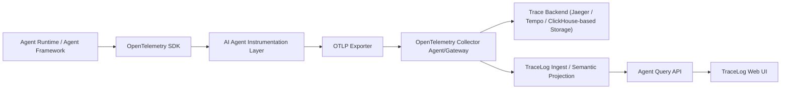

# AI Agent Trace Observability 最佳实践设计方案

## 1. 文档目标

本文重新定义 TraceLog 的目标形态，不再以“日志采集器”作为核心前提，而是以 **OpenTelemetry 官方 SDK + OpenTelemetry Collector + Agent 专属观测服务** 为主线，设计一套适合 AI Agent 场景的最终版本方案。

本文回答的问题是：

- 如果允许使用 SDK，AI Agent 轨迹采集的最佳实践是什么
- 如何在遵循 OpenTelemetry 标准的前提下，采集 Agent 专属语义
- Collector、存储、服务端、前端分别应该承担什么职责
- OpenTelemetry 官方能力与自研 Agent 语义层之间应该如何分工

## 2. 设计结论

最佳实践不是自定义一套 tracing 协议，也不是继续围绕日志反推 span，而是：

- 使用 **OpenTelemetry 官方 SDK** 作为 tracing 底座
- 在 SDK 之上封装一层 **AI Agent Instrumentation Layer**
- 通过 **OTLP** 发往 **OpenTelemetry Collector**
- 底层 trace 存储尽量使用成熟 trace backend
- TraceLog 聚焦做 **AI Agent 语义增强、调试视图、问题定位体验**

一句话概括：

> OpenTelemetry 负责“标准化 trace 基础设施”，TraceLog 负责“AI Agent 语义理解与调试体验”。

## 3. 最终目标架构



### 3.1 分层职责

- `OpenTelemetry SDK`
  - 创建 trace/span/event
  - 做 context propagation
  - 负责 OTLP 导出
- `AI Agent Instrumentation Layer`
  - 将 Agent 运行语义稳定映射为 spans / attributes / events
  - 统一命名与字段规范
- `OpenTelemetry Collector`
  - 负责接收、处理、批量、路由、转发
- `Trace Backend`
  - 提供原始 trace 的持久化与基础查询
- `TraceLog`
  - 将原始 trace 投影成 Agent 视图
  - 提供 Run、Step、LLM、Tool、Error、Token 等专属分析能力

## 4. 为什么必须基于 OpenTelemetry 官方 SDK

### 4.1 OTel SDK 已经解决的问题

OpenTelemetry 官方 SDK 本身已经具备：

- trace/span 生命周期管理
- attributes / events / status 表达
- trace context 传播
- OTLP exporter
- 多语言支持
- 与 Collector 的天然兼容

因此不应该自研新的 tracing SDK。

### 4.2 仍然需要一层 Agent Instrumentation 的原因

OpenTelemetry SDK 提供的是通用 tracing 能力，但它并不知道 AI Agent 领域里的这些概念：

- `agent.run`
- `plan / act / reflect / synthesize`
- `llm call`
- `tool call`
- `retrieval`
- `memory update`
- `sub-agent handoff`
- `token usage`
- `prompt / response / tool args / tool result`

如果直接让业务开发自己拿 OTel SDK 手写 spans，常见问题会是：

- span 名称不统一
- attributes 命名不统一
- prompt / token / tool 采集口径混乱
- 前端无法做统一展示

因此最佳实践是：

- **底层 tracing 用 OpenTelemetry SDK**
- **上层语义规范由 Agent Instrumentation Layer 统一封装**

这层“Agent SDK”不是替代 OTel，而是对 OTel 的领域封装。

## 5. 推荐的数据模型

## 5.1 领域对象

从 Agent 视角，推荐关注这些核心对象：

- `Run`
  - 一次 Agent 执行
- `Step`
  - 一次可解释的 Agent 步骤
- `LLM Invocation`
  - 一次模型调用
- `Tool Invocation`
  - 一次工具调用
- `Retrieval`
  - 一次检索 / 向量查询 / rerank
- `Memory Update`
  - 一次记忆写入或读取
- `Handoff`
  - 子 Agent 或角色切换
- `Event`
  - retry、exception、stream delta、guardrail hit、manual override

### 5.2 与 OTel Span 的映射

- `Run` -> root span
- `Step` -> root span 的子 span
- `LLM Invocation` -> Step 的子 span
- `Tool Invocation` -> Step 的子 span
- `Retrieval` -> Tool 或 Step 的子 span
- `Event` -> span event

### 5.3 推荐 span kind 与命名

推荐统一 span 名称而不是由业务随意命名：

- `agent.run`
- `agent.step.plan`
- `agent.step.retrieve`
- `agent.step.reason`
- `agent.step.write`
- `llm.chat.completions`
- `tool.call`
- `retrieval.search`
- `memory.read`
- `memory.write`
- `agent.handoff`

推荐统一 `kind` 语义：

- `agent`
- `llm`
- `tool`
- `retrieval`
- `memory`
- `workflow`

## 6. 推荐采集字段

### 6.1 Run 级字段

- `agent.name`
- `agent.version`
- `agent.session_id`
- `agent.run_id`
- `user.id` 或匿名用户标识
- `request.id`
- `environment`
- `input.summary`
- `output.summary`
- `final.status`

### 6.2 Step 级字段

- `agent.step.index`
- `agent.step.name`
- `agent.step.type`
- `agent.step.goal`
- `agent.step.input`
- `agent.step.output`
- `agent.step.decision_reason`

### 6.3 LLM 级字段

- `gen_ai.provider.name`
- `gen_ai.request.model`
- `gen_ai.operation.name`
- `gen_ai.request.temperature`
- `gen_ai.request.max_tokens`
- `gen_ai.usage.input_tokens`
- `gen_ai.usage.output_tokens`
- `llm.prompt.template`
- `llm.prompt.rendered`
- `llm.response.content`
- `llm.finish_reason`
- `llm.cache_hit`

### 6.4 Tool 级字段

- `tool.name`
- `tool.type`
- `tool.input`
- `tool.output`
- `tool.retry_count`
- `tool.timeout_ms`
- `http.method`
- `http.url`
- `http.status_code`

### 6.5 Retrieval / Memory 级字段

- `retrieval.query`
- `retrieval.top_k`
- `retrieval.hit_count`
- `retrieval.corpus`
- `memory.namespace`
- `memory.keys`
- `memory.operation`

### 6.6 Event 级字段

- `exception.type`
- `exception.message`
- `exception.stacktrace`
- `retry.attempt`
- `retry.reason`
- `stream.delta`
- `guardrail.policy`
- `guardrail.action`

## 7. AI Agent Instrumentation Layer 设计

## 7.1 设计目标

Instrumentation Layer 应该尽量让开发者少写 tracing 代码，而不是多写 tracing 代码。

目标是：

- 统一命名规范
- 自动管理 parent-child
- 自动附加标准 attributes
- 针对主流 LLM / Tool / Framework 提供 adapter
- 尽可能自动采集 prompt、response、tokens、error

### 7.2 推荐能力

建议提供以下能力：

- `start_run()` / `end_run()`
- `start_step(name, type)`
- `trace_llm_call()`
- `trace_tool_call()`
- `trace_retrieval()`
- `trace_memory_op()`
- `add_event()`
- `set_user_context()`
- `redact_payload()`

### 7.3 推荐调用方式

```python
with tracer.run(agent_name="research-agent", user_input=query):
    with tracer.step("plan", step_type="reasoning"):
        plan = traced_llm.generate(...)

    with tracer.step("retrieve", step_type="retrieval"):
        docs = traced_tool.search(...)

    with tracer.step("write", step_type="synthesis"):
        answer = traced_llm.generate(...)
```

这层封装底层仍然调用 OTel SDK 创建 spans。

## 7.4 框架适配优先级

建议优先适配：

- OpenAI SDK
- Azure OpenAI SDK
- Anthropic SDK
- LangChain
- LlamaIndex
- AutoGen
- CrewAI
- 自定义 Tool Decorator

## 8. Prompt 与内容采集策略

AI Agent 可观测系统和传统 tracing 最大差异在于内容敏感。

因此采集策略必须内建分级控制。

### 8.1 建议的采集级别

- `metadata_only`
  - 只采模型、耗时、token、状态码、tool name
- `masked_content`
  - 采内容，但对敏感字段脱敏
- `full_content`
  - 全量采集，仅限开发 / 调试 / 小范围环境

### 8.2 建议的脱敏对象

- 用户输入中的手机号、身份证号、邮箱
- API key、token、cookie
- 数据库连接串
- Prompt 中的敏感业务实体
- Tool 输出中的 PII

### 8.3 最佳实践

- SDK 层支持脱敏，避免敏感内容先被完整发送
- Collector 层支持第二道属性过滤
- 服务端支持租户级内容查看权限

## 9. Collector 最佳实践

Collector 仍然是标准链路中的关键组件，但职责应克制。

Collector 最适合承担：

- OTLP receiver
- `memory_limiter`
- `batch`
- `attributes`
- `resource`
- `routing`
- 可选的 `transform`

不建议让 Collector 承担复杂业务语义解析，因为：

- 规则维护困难
- 领域逻辑不适合写在 Collector 配置里
- 变更成本高

### 9.1 推荐拓扑

- 小规模：应用 -> Collector -> Trace Backend / TraceLog
- 中大规模：应用 -> Node Collector -> Gateway Collector -> Backend

### 9.2 推荐 processors

- `memory_limiter`
- `batch`
- `attributes`
- `resource`
- `transform`（只做轻量字段修正）

### 9.3 是否启用采样

对于 AI Agent 调试，一般不建议在开发与诊断环境做 aggressive sampling。

建议：

- 开发环境：不采样
- 灰度环境：按服务或用户采样
- 生产环境：按租户、场景、错误优先采样

## 10. 底层存储的最佳实践

如果追求最终形态，不建议一开始就让 TraceLog 自己承担完整 trace backend 的职责。

### 10.1 推荐策略

- 原始 trace 存储交给成熟系统
- TraceLog 侧存储 Agent 语义投影与索引

推荐组合：

- `Jaeger`
- `Grafana Tempo`
- `ClickHouse-based trace storage`

### 10.2 为什么不建议全部自研

- 原始 trace 存储、索引、保留策略、压缩和查询优化都很重
- 这些能力不是 AI Agent 观测的核心差异化
- 自研更容易把团队精力消耗在“底座建设”而不是“Agent 调试价值”

### 10.3 TraceLog 最适合自研的部分

- Agent 语义抽取
- Run / Step / Tool / LLM 视图
- Prompt / Token / Error / Retry 的关联分析
- 调试与解释体验

## 11. 服务端最终职责

最终版服务端建议拆成两层：

### 11.1 Trace Platform Layer

职责：

- 接收 OTel trace
- 原始 span 数据落库或索引
- 提供 trace 查询能力
- 处理租户隔离、权限、保留策略

### 11.2 Agent Semantic Layer

职责：

- 将 spans 投影成 `Run / Step / LLM / Tool / Event`
- 聚合 token、cost、latency、error chain
- 建立 Agent 专属查询模型
- 提供前端直接可用的高层 API

### 11.3 推荐服务端 API 视图

除了原始 trace API，还应有专门的 Agent 视图 API：

- `GET /runs`
- `GET /runs/{run_id}`
- `GET /runs/{run_id}/steps`
- `GET /runs/{run_id}/llm-calls`
- `GET /runs/{run_id}/tool-calls`
- `GET /runs/{run_id}/errors`
- `GET /runs/{run_id}/token-summary`

## 12. 前端最终形态

前端不应只是“通用 trace viewer”，而应是 “Agent-first Debug UI”。

### 12.1 推荐页面结构

- `Run Overview`
  - 目标、输入摘要、最终结果、总耗时、状态、token
- `Step Timeline`
  - plan / retrieve / reason / write 的步骤序列
- `Waterfall`
  - 用于看并发、依赖、阻塞
- `LLM Inspector`
  - model、prompt、response、finish_reason、tokens
- `Tool Inspector`
  - tool input/output/error/http code
- `Evidence / Events`
  - retry、stream delta、exception、guardrail

### 12.2 推荐视角

用户真正关心的问题通常是：

- Agent 做了哪些步骤
- 为什么会做这一步
- 哪个模型参与了决策
- 调用了哪些工具
- 哪一步最慢
- 为什么最终结果不好

因此 UI 必须优先回答这些问题，而不是只展示原始 span 列表。

## 13. 上下文传播与跨服务协作

即使聚焦 AI Agent，也必须遵循标准 trace context 传播。

### 13.1 推荐方式

- HTTP：`traceparent` / `tracestate`
- gRPC：metadata
- MQ：message headers
- 子进程：环境变量或显式参数

### 13.2 顺序如何判断

- `span_id` 不表示顺序
- `parent_span_id` 表示依赖关系
- `start_time / end_time` 表示时间先后
- 线性步骤序号应使用 `agent.step.index`

## 14. 错误、重试、部分更新的最佳实践

### 14.1 错误

推荐同时记录：

- span status
- exception event
- 领域级 error attributes

### 14.2 重试

重试不要隐藏，应明确记录：

- `retry.attempt`
- `retry.reason`
- 原始失败 span
- 最终成功 span

### 14.3 流式输出

流式模型输出建议：

- 使用 span event 记录 stream delta
- 最终 response 作为 output 汇总

### 14.4 部分更新

若 span 分阶段产生内容：

- start 阶段记录基础输入
- 中间用 events 记录增量
- end 阶段补齐 output/status/tokens

服务端要支持 merge，而不是后到字段覆盖先到字段。

## 15. 推荐实施路径

### Phase 1：Agent SDK 最小闭环

- 基于 OTel SDK 封装 Run / Step / LLM / Tool tracing
- Collector 接入
- 原型前端展示

### Phase 2：框架适配与内容治理

- OpenAI / LangChain / LlamaIndex adapter
- prompt/output 脱敏
- token / cost 聚合

### Phase 3：平台化

- 多语言 SDK
- 多租户权限
- 存储后端演进
- Agent 诊断与回放体验

## 16. 关键取舍

### 16.1 为什么不再以日志采集器为核心

因为日志反推 span 有天然缺陷：

- parent-child 容易缺失
- 时序容易不准确
- prompt / token / tool 参数不完整
- 跨服务上下文传播难恢复

它适合作为补充通道，不适合作为最佳实践主路径。

### 16.2 为什么不是“直接只用 OTel SDK 就结束”

因为仅有 OTel SDK 还不够形成统一 Agent 语义。

最佳实践不是“重写 SDK”，而是：

- 用 OTel SDK 做 tracing 基础设施
- 用 Agent Instrumentation Layer 做领域建模

### 16.3 为什么不建议所有能力都堆进 Collector

Collector 适合做基础设施处理，不适合承载复杂 Agent 语义逻辑。

复杂语义应放在：

- SDK 层采集
- 服务端投影
- 前端展示

## 17. 最终建议

最终版本的最佳实践可以概括为四句话：

- **采集标准化**：用 OpenTelemetry 官方 SDK
- **语义统一化**：封装 AI Agent Instrumentation Layer
- **传输基础设施化**：统一通过 OpenTelemetry Collector
- **产品价值 Agent-first**：TraceLog 聚焦 Agent 语义分析与调试体验

对 TraceLog 而言，真正的差异化不应该是“自己重造一个 tracing SDK 或 trace backend”，而应该是：

- 把 AI Agent 的运行过程表达清楚
- 把问题定位路径做顺
- 把 prompt / tool / token / retry / error 串成一个可解释的调试视图

